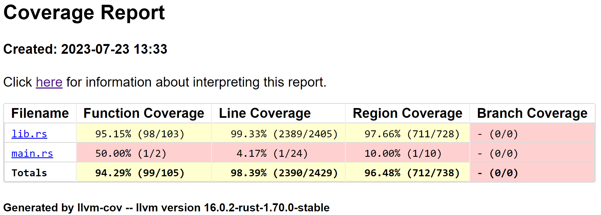

# Readme

### Goal
1. Goal of the project
    - Analyse a python script.
    - Notify the user when an import is not used.
    - Notify the user when a function is never called.
    - Notify the user when a refenced variable is either not defined or 'out of scope'. This doesn't give an error but sometimes leads to undesired behaviour. This is the primary function of the program.
    - Notify the user of inconsistent indentation.
    - Notify the user of usage of global variables without using 'global <variable\>' in the function.
    - Classes inside of classes.
    - Classes inside of functions.
2. Things that are not going to be supported
    - Checking for invalid variable names/function names/class names (invalid names will be skipped).
    - Multiline assignments.

### General notes

**12-07-2023**<br />
Maybe pretend the entire file (except the root) is a function, and handle the file as a function (aka get list of functions, imports, classes, variables), but handle it as a root case (the global keyword can be used in this function). Then analyse any subfunction the same way (but without root), and any class can be handled with its own handling function (which should only be slightly different). This way you can create a nested analysis, in which each object deeper has its own scope.
Also create warning codes so the user can suppress warnings that they don't want to see. (Be careful not to create a linter, those already exist.)<br />

15.56<br />
Pushed local git repository to remote github repository.

22.24<br />
Properties of each type of python object (file is entire file, function is function, class is class):

1. File
    - name
    - parameters (commandline)
    - imports
    - global variables
    - functions
    - classes
    - roots
2. Function
    - name
    - parameters
    - imports
    - variables defined in scope
    - subfunctions
    - subclasses
3. Class
    - name
    - parent
    - static class variables
    - class instance variables
    - functions
    - classes

**13-07-2023**<br />
14.34<br />
I don't need the roots field in the File struct which could be used to track the callstack, because any callstack issues are handled by the python interpreter.

**15-07-2023**<br />
00.18<br />
The current problem is that the regex pattern for class variables in class returns false positives on variables defined in class methods. I'll be fixing this tomorrow.

**17-07-2023**<br />
15.40<br />
The file processing functionality is now entirely contained in the lib.rs file, main.rs looks a lot cleaner now.

**19-07-2023**<br />
14.49<br />
I don't have a clear scope for the project right now. At the moment I have implemented reading in a file, extracting functions and classes, and extracting classes inside of classes. I am working on a struct called 'Assignment' in an effort to detect when variables are defined and what they are called. At the end of the day the goal of this project was to detect when a variable is used out of scope. For example when there is a for loop looping over list indices with the looping variable called index, and index is referenced after the for loop, python does not throw an error, but this may be undesirable.

15.04<br />
Variable assignments are supported in this exact way:<br />
&emsp;```^[\t ]*(?P<var>\w+)[\t ]*(:.*)?=[\t ]*(?P<val>.*)$```<br />
This allows for type hinting when assigning a variable. This is only recognized as an assignment if any equal signs in the part after the first equal sign are enclosed in either of the following:<br />
&emsp;'', "", (), [], {}

15.22<br />
I am currently deciding that dictionary key validity on assignment will not be checked.

21.47<br />
I have implemented the Assignment struct today and changed the type of class variables from String to Assignment.

22.53<br />
I have reimplemented the Class::get_source() method, it now reconstructs the source from the functions, classes, and variables inside the class.

23.16<br />
Renamed every Struct::create() method to Struct::new().

**20-07-2023**<br />
10.25<br />
Today I'll start merging the Function struct and the ClassMethod struct into one Function struct, as a function and a method are essentially the same thing.

12.11<br />
The Function struct and the ClassMethod struct are now merged into one Function struct. Parameters in the function definition are now formatted a little neater.

13.31<br />
I've been messing around with trying to get the formatter to not change data inside of quotations, so far I've tried matching every case of " c" or "c " where c can be an equal sign or a \[ or whatever. I think I'm thinking about this way too difficult, I can just remove all spaces not inside quotations, and then add spaces after every comma and colon not inside quotations.

16.03<br />
Something to do in the future is to change from looping over character to looping over grapheme clusters (where applicable). [This stackoverflow answer](https://stackoverflow.com/a/58770681) suggested doing that, refering to [the documentation](https://unicode-rs.github.io/unicode-segmentation/unicode_segmentation/trait.UnicodeSegmentation.html#tymethod.graphemes) for the [unicode_segmentation crate](https://unicode-rs.github.io/unicode-segmentation/unicode_segmentation/index.html).

16.49<br />
I fixed the issue with the neat function parameters. The solution I came up with is a lot easier than the solutions I had been trying before. I now loop over the characters in the parameter while skipping spaces not in quotations, then I add all the characters to a new string, with an extra space in case the character is a comma or a colon.

18.59<br />
There were some bugs with the function parameter formatter, namely that it considered brackets in strings as valid brackets, splitting on commas where it shouldn't. This is now fixed.

21.00<br />
The same bug was present in checking if a line is an assignment, this is also fixed now.

21.05<br />
I've also added more tests to the is_assignment test function containing random strings of ascii/unicode characters.

21.32<br />
I have pushed the changes to the repo. I think the next step is to implement recursive functions, but this time I will implement the tests first. After that I will have classes in classes, functions in classes, and functions in functions. Only classes in functions remains then.<br />
After that I should probably start implementing printing warnings to the commandline in response to the issues presented at the top of this document under **Goal**.

22.09<br />
I am now done implementing one test file, `test/recursive_functions.py`, which contains one double nested function and one triple nested function. I hope that by induction this will guarantee that any degree of nested funtions will work.

23.09<br />
For some weird reason the tests for the recursive functions return positive even though the file structs are not equal, very weird, it's probably me who doesn't understand rust though.

**21-07-2023**
00.13<br />
I finally found the bug! I hadn't implemented the functions vector into the PartialEq implementation of the Function struct yet.

12.54<br />
I have implemented tests to check if the PartialEq implementations work correctly. This should make the bug from yesterday impossible to occur without triggering a test failure.

17.34<br />
Recursive functions/subfunctions are now implemented as well as methods for converting structs to strings for each custom struct.

18.07<br />
I changed the type of global file variables from String to Assignment.

**22-07-2023**
12.55<br />
I did some googling yesterday and I am probably going to use the `cargo-llvm-cov` crate to monitor the test coverage.

13.35<br />
The command to install llvm-cov is `cargo +stable install cargo-llvm-cov --locked` ([source](https://github.com/taiki-e/cargo-llvm-cov#from-source)). The command to run llvm-cov (and generate an HTML report, and show untested lines) is `cargo llvm-cov --html --show-missing-lines`.

**23-07-2023**
13.05<br />
I just finished implementing many tests to cover as many lines as possible (according to the llvm-cov report).

13.23<br />
The only untested lines are:<br />
&emsp;- test cases which should not fail ever, if they do the tests fail as well<br />
&emsp;- the skipping empty lines check in the Class struct (for some reason I can't get this line to be executed, I might get back to this later)<br />
&emsp;- two cases where an option enum should always be matched, if it doesn't something is very wrong, so it is expected that these lines are never executed<br />
&emsp;- a warning message which gets printed if the filename specified does not have the extension ".py", as I don't know how to test if the warning was actually printed ([this forum answer](https://users.rust-lang.org/t/how-to-test-output-to-stdout/4877/6) suggests writing to a generic stream instead of the standard output)<br />

I think the test coverage is good for now:


18.53<br />
Just a note on the command line arguments that I use with llvm-cov (the command is `cargo llvm-cov --html --lib --show-missing-lines`):<br />
&emsp;`--html` generates an html report instead of output to the standard output (this argument is also used to generate the report above)<br />
&emsp;`--lib` test only this library's unit tests (only lib.rs in my case)<br />
&emsp;`--show-missing-lines` prints all line numbers to the console which were not executed during the tests

19.01<br />
I could probably add an extra parameter (`should_match: bool`) to the test cases which should never fail, and add extra test cases which should not match which have this parameter set to false. This way I also test that the regex patterns do not match when they should not match.

19.23<br />
I found out why the is_empty() line in Class::new() is never called: empty lines are removed at the start of the function. I need the first non-empty line (for the class definition) and the second non-empty line (for the class indentation). I'm not sure if it's worth reworking that part of the function, I could also remove the check if the line is empty in the loop. I'm adding it to the todo list and deciding on it later.

**24-07-2023**
15.01<br />
The goal of the program is to output warnings per function/class/class method. The file struct could have a function which returns a report containing the warnings (or something like "No warnings." if no warnings were emitted). I can check if an import/variable was used by checking if it exists in a line (not in quotations) which is not an assignment.<br />

I am hesitant to merge dev into master right now because not 100% of branches are tested. I will probably be more sure about this if I implement the tests to test if the regexes fail when they should, and if I implement writing to a generic stream instead of standard output (following [this suggestion](https://users.rust-lang.org/t/how-to-test-output-to-stdout/4877/6)) (that way I can test if messages were actually sent to the stream, which also helps a lot when implementing the warning messages).

**25-07-2023**
22.36<br />
Switched from printing messages to the standard output to adding them to a BufWriter wrapping anything which implements the Write trait. This could be the standard output or a file, for example.

**26-07-2023**
16.34<br />
Done implementing the regex fail tests.

**28-07-2023**
01.29<br />
Implemented support for single- and multiline comments inside functions and classes. The next thing to do is to implement tests for testing if single- and multiline comments work in the file struct.

18.26<br />
Single- and multiline comments are now fully supported.

22.09<br />
Merged `dev` branch into `master` branch.

**29-07-2023**
12.25<br />
Moved functions which do not need to be part of the File struct out of the File struct. Also renamed the test function.
